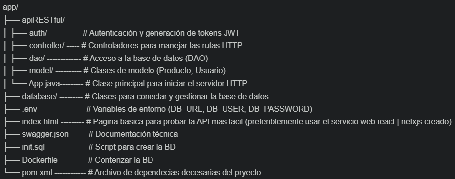
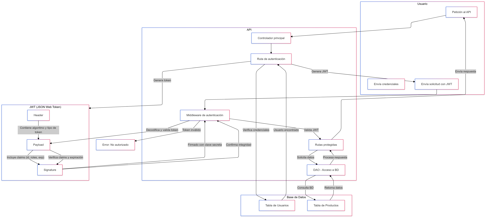

# Proyecto Java API RESTful con >> Maven | Docker| MySQL | JWT << para Gestión de Productos y Autenticación
#### SERGIO DANIEL LOPEZ VARGAS
___

## Descripción

Este proyecto implementa una API RESTful en Java utilizando la clase `HttpServer` de la biblioteca estándar, sin depender de frameworks como Spring Boot. Ofrece gestión de productos y usuarios con operaciones CRUD, incluyendo registro e inicio de sesión de usuarios autenticados mediante tokens JWT. Además, cuenta con un sistema de protección de endpoints que asegura que solo los usuarios autenticados puedan acceder a ciertas rutas. Los datos se almacenan en una base de datos MySQL, la cual es contenerizada con Docker, y se utiliza Maven para gestionar las dependencias y ejecutar la aplicación. También incluye pruebas unitarias para garantizar la calidad y el correcto funcionamiento del código.

## Estructura del Proyecto

El proyecto está estructurado de la siguiente manera:



## Funcionalidades

1. **Autenticación de usuarios (JWT)**:
    - Permite a los usuarios iniciar sesión y recibir un token JWT.
    - El token se utiliza para autenticar las solicitudes a los endpoints protegidos.

2. **Gestión de productos**:
    - Los productos pueden ser creados, leídos, actualizados y eliminados.
    - Requiere autenticación para acceder a la mayoría de las operaciones.

3. **Endpoints protegidos**:
    - Los endpoints de productos requieren un token JWT válido para acceder.
    - Los usuarios no autenticados reciben un error 401 (Unauthorized).

## Variables de Entorno
Asegúrate de configurar las siguientes variables en un archivo `.env` ubicado en la raíz del proyecto. **Nota:** Este archivo estara subido pero únicamente para pruebas locales, ya que estamos en un entorno de desarrollo. Sin embargo, en un escenario real, **no debe subirse** al repositorio para garantizar la seguridad.
```
DB_URL=jdbc:mysql://localhost:3306/database_name
DB_USER=your_database_user
DB_PASSWORD=your_database_password
```
## Base de Datos
La base de datos debe contener al menos dos tablas: `users` y `products`. La tabla users debe tener las siguientes columnas:

```sql
CREATE TABLE users (
    id INT AUTO_INCREMENT PRIMARY KEY,
    username VARCHAR(255) NOT NULL,
    password VARCHAR(255) NOT NULL
);
```

La tabla `products` debe tener las siguientes columnas:

```sql
CREATE TABLE products (
    id VARCHAR(255) PRIMARY KEY,
    name VARCHAR(255) NOT NULL,
    description TEXT NOT NULL,
    price DOUBLE NOT NULL,
    quantity INT NOT NULL
);
```
### NOTA 
#### No necesitas crearla manualmente ni realizar ningún despliegue adicional. El proyecto ya incluye un archivo `Dockerfile` y un script `init.sql` que, con unos pocos comandos, se encargan de realizar este proceso automáticamente.

## Dependencias

- `dotenv` para gestionar las variables de entorno.
- `com.sun.net.httpserver.HttpServer` para crear el servidor HTTP.
- `io.jsonwebtoken` para generar y validar tokens JWT.

## pom.xml
Estas dependencias están organizadas para cubrir las funcionalidades necesarias y extras del proyecto:

- Pruebas: `JUnit`, `Mockito`.
- Persistencia: `MySQL Connector`.
- Seguridad: `JJWT` (API, implementación, y JSON processing).
- JSON: `Gson`.
- Configuración: `dotenv-java`.

---

# Diagrama de diseño detallado


---
# API Endpoints

La API RESTful ofrece varios endpoints para manejar autenticación, productos y usuarios. A continuación, se detallan los endpoints disponibles.

### 1. Autenticación

#### **POST `/login`**
Inicia sesión y devuelve un token JWT.

- **Parámetros:**
  - `username`: Nombre de usuario.
  - `password`: Contraseña del usuario.

#### Respuesta:
- **200 OK**: Si las credenciales son válidas y el token JWT se genera correctamente.
  ```json
  {
    "token": "jwt_token_here"
  }
  ```

- **401 Unauthorized**: Si las credenciales son incorrectas.
  ```json
  {
    "message": "Invalid credentials"
  }
  ```

---

### 2. Gestión de Usuarios

#### **GET `/users`**
Obtiene todos los usuarios almacenados en la base de datos.

- **Método**: `GET`
- **Request Body**: No aplica (no se envía cuerpo en la solicitud).

#### Respuesta:
- **200 OK**: Devuelve una lista de usuarios en formato JSON.
  ```json
  [
    {
      "id": 1,
      "username": "user1",
      "password": "password123"
    },
    {
      "id": 2,
      "username": "user2",
      "password": "password456"
    }
  ]
  ```

- **405 Method Not Allowed**: Si se usa un método diferente de `GET`.
  ```json
  {
    "message": "Method Not Allowed"
  }
  ```

#### **POST /users**
Agrega un nuevo usuario a la base de datos.

- **Método**: `POST`
- **Request Body**:
  ```json
  {
    "username": "newUser",
    "password": "newPassword123"
  }
  ```

#### Respuesta:
- **201 Created**: Si el usuario se crea correctamente.
  ```json
  {
    "message": "User added"
  }
  ```

- **400 Bad Request**: Si los datos del usuario son inválidos (por ejemplo, campos faltantes).
  ```json
  {
    "message": "Invalid user data"
  }
  ```

- **500 Internal Server Error**: Si hay un error al agregar el usuario.
  ```json
  {
    "message": "Failed to add user"
  }
  ```

- **405 Method Not Allowed**: Si se usa un método diferente de `POST`.
  ```json
  {
    "message": "Method Not Allowed"
  }
  ```

#### **PUT `/users/{id}`**
Actualiza un usuario existente en la base de datos. El `id` del usuario debe ser proporcionado en la URI.

- **Método**: `PUT`
- **Request Body**:
  ```json
  {
    "username": "updatedUser",
    "password": "updatedPassword123"
  }
  ```

#### Respuesta:
- **200 OK**: Si el usuario se actualiza correctamente.
  ```json
  {
    "message": "User updated"
  }
  ```

- **400 Bad Request**: Si los datos del usuario son inválidos o el `id` no es proporcionado.
  ```json
  {
    "message": "Invalid user data"
  }
  ```

- **404 Not Found**: Si el usuario con el `id` especificado no existe.
  ```json
  {
    "message": "User not found"
  }
  ```

- **405 Method Not Allowed**: Si se usa un método diferente de `PUT`.
  ```json
  {
    "message": "Method Not Allowed"
  }
  ```

#### **DELETE `/users/{id}`**
Elimina un usuario de la base de datos. El `id` del usuario debe ser proporcionado en la URI.

- **Método**: `DELETE`
- **Request Body**: No aplica (no se envía cuerpo en la solicitud).

#### Respuesta:
- **200 OK**: Si el usuario se elimina correctamente.
  ```json
  {
    "message": "User deleted"
  }
  ```

- **404 Not Found**: Si el usuario con el `id` especificado no existe.
  ```json
  {
    "message": "User not found"
  }
  ```

- **405 Method Not Allowed**: Si se usa un método diferente de `DELETE`.
  ```json
  {
    "message": "Method Not Allowed"
  }
  ```


---

### 3. Protected Endpoint

#### GET `/protected`
- **Method**: `GET`
- **Description**: Este endpoint está protegido mediante autenticación con un token JWT. Solo se permite el acceso si el token proporcionado en el encabezado `Authorization` es válido.

#### Request:
- **Headers**:
  - `Authorization`: Un token JWT en el encabezado de la solicitud, precedido por la palabra clave `Bearer`. Ejemplo:
    ```
    Authorization: Bearer <your_jwt_token>
    ```

#### Respuesta:

1. **Código de estado 200**: Si el token es válido y la solicitud es exitosa.
    - **Body**:
    ```json
    {
      "message": "Request successful. You are authenticated."
    }
    ```

2. **Código de estado 401**: Si el token es inválido o no está presente.
    - **Body**:
    ```json
    {
      "message": "Unauthorized: Invalid token"
    }
    ```
   
3. **Código de estado 401**: Si el encabezado `Authorization` está ausente o mal formado.
    - **Body**:
    ```json
    {
      "message": "Unauthorized: Missing or malformed Authorization header"
    }
    ```

4. **Código de estado 405**: Si el método HTTP no es `GET`.
    - **Body**:
    ```json
    {
      "message": "Method Not Allowed"
    }
    ```

---
### 4. Endpoints de Producto

Este documento describe los endpoints disponibles para gestionar productos en el sistema. Los endpoints permiten realizar operaciones CRUD (Crear, Leer, Actualizar, Eliminar) en los productos.

#### **GET `/products`**
Obtiene todos los productos del sistema.

#### Response (200 OK)
```json
[
    {
        "id": 1,
        "name": "Producto A",
        "description": "Descripción del producto A",
        "price": 100.0,
        "quantity": 50
    },
    {
        "id": 2,
        "name": "Producto B",
        "description": "Descripción del producto B",
        "price": 150.0,
        "quantity": 30
    }
]
```
#### POST `/products`

Agrega un nuevo producto a la base de datos.

- **Método**: `POST`
- **Request Body**:
  ```json
    {
        "name": "Producto C",
        "description": "Descripción del producto C",
        "price": 200.0,
        "quantity": 40
    }

  ```

#### Respuesta:

```json
{
    "message": "Product added: Product{name='Producto C', description='Descripción del producto C', price=200.0, quantity=40}"
}
```

#### PUT `/products/{productId}`
Actualiza un producto existente por su ID.

- **Método**: `PUT`
- **Request Body**:
  ```json
  {
    "username": "updatedUser",
    "password": "updatedPassword123"
  }
  ```
   
#### Respuesta:

- **200 OK:** Si el producto se actualiza correctamente.
 ```json
{
    "name": "Producto C Actualizado",
    "description": "Descripción actualizada del producto C",
    "price": 250.0,
    "quantity": 45
}
 ```

- **404 Not Found**: Si el producto con el `productId` especificado no existe.
```json
{
    "message": "Product not found"
}
```

#### DELETE `/products/{productId}`

Elimina un producto del sistema.

- **Método**: `DELETE`
- **Request Body**: No aplica (no se envía cuerpo en la solicitud).

#### Respuesta:
- **200 OK**: Si el producto se elimina correctamente.
  ```json
  {
    "message": "Product deleted."
  }
  ```

- **404 Not Found**: Si el usuario con el `productId` especificado no existe.
  ```json
  {
    "message": "Product not found"
  }
  ```

- **405 Method Not Allowed**: Si se usa un método diferente de `DELETE`.
  ```json
  {
    "message": "Method Not Allowed"
  }
  ```

---
### 5. Control CORS
Para todas las respuestas, se añaden los encabezados CORS para permitir solicitudes desde cualquier origen y especificar métodos y encabezados permitidos:

- **Encabezados CORS**:
  ```text
  Access-Control-Allow-Origin: *
  Access-Control-Allow-Methods: GET, POST, PUT, DELETE, OPTIONS
  Access-Control-Allow-Headers: Content-Type, Authorization
  Access-Control-Allow-Credentials: true
  ```
---

## Autenticación
La API utiliza autenticación basada en **JWT**. Para acceder a los endpoints protegidos, debes incluir un token válido en el encabezado `Authorization` de la solicitud. El formato del encabezado es:

```text
Authorization: Bearer {token}
```

---

## Notas Adicionales
- Todos los endpoints están protegidos por CORS.
- La autenticación mediante JWT es obligatoria para realizar solicitudes a endpoints protegidos.

---

# Pasos para ejecutar el proyecto

### Paso 1: Descargar proyecto
* Clone el repositorio de GitHub:

```
git clone https://github.com/sergiolopezzl/prueba-dav-apiRESTful.git
```

* Navegue al directorio del proyecto: 

```
cd prueba-dav-apiRESTful
```

### Paso 2: Construir imagen Docker y ejecutar el contenedor MySQL

* Construye la imagen de Docker con el siguiente comando:

```
docker build -t my-mysql-image .
```

* Ejecuta un contenedor de Docker con la imagen de MySQL creada anteriormente. Este comando expondrá el puerto 3306 del contenedor al puerto 3306 en tu máquina local:

```
docker run -d --name my-mysql-container -p 3306:3306 my-mysql-image
```

* Iniciar el contenedor MySQL (si no está en ejecución)

```
docker start my-mysql-container
```
### Paso 3: Compilar el proyecto con Maven

* Compila el proyecto y ejecuta las pruebas unitarias

```
mvn clean install
```

### Paso 4: Ejecutar la aplicación principal `App.java`

* Ejecute `App.java` utilizando el siguiente comando: 

```
mvn exec:java '-Dexec.mainClass=app.apiRESTful.App'
```

### Paso 5: Probar API

* Abrir el archivo `index.html` que esta en el directorio raiz utilizando el siguiente comando:

```
start index.html
```

* Con la documentacion swagger en tu navegador `http://localhost:8000/swagger-ui`

___

# Interfaz grafica en >> React | Next.js <<

Este proyecto implementa una API RESTful para la gestión de productos y está desarrollado con React y Next.js. Incluye funcionalidades de autenticación(login y registro), manejo de productos(CRUD) y un sistema de enrutamiento para gestionar los diferentes componentes de la aplicación.

## Requisitos

Antes de comenzar, asegúrate de tener las siguientes herramientas instaladas en tu sistema:

- [Node.js](https://nodejs.org/) (v20 o superior recomendado)
- [npm](https://www.npmjs.com/) o [yarn](https://yarnpkg.com/) (para manejar las dependencias) **Preferiblemente >>** [npm](https://www.npmjs.com/)

---

# Pasos para ejecutar el proyecto

### Paso 1: Descargar proyecto 
* Clone el repositorio de GitHub:

```
git clone https://github.com/sergiolopezzl/prueba-dav-api-inventory-restful-front.git
```

* Navegue al directorio del proyecto: 

```
cd prueba-dav-api-inventory-restful-front
```

### Paso 2: Instala las dependencias del proyecto

```
npm install
```

### Paso 3: Para iniciar el proyecto en modo desarrollo, ejecuta

```
npm run dev
```

***Asegúrate de que el backend esté en ejecución; si no es así, revisa las instruccione para ejecutar la API RESTful.***

### Demostración de la instalación y funcionamiento de todo el proyecto`video`

